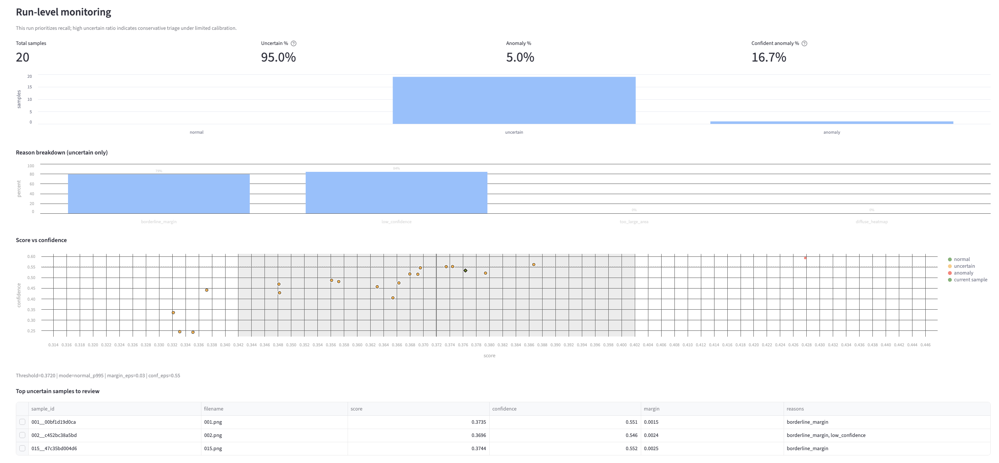
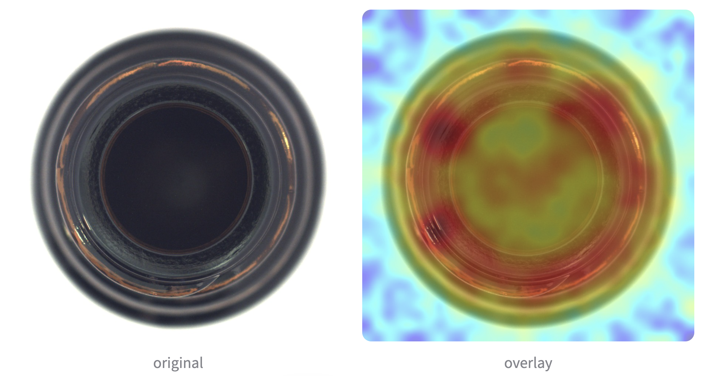
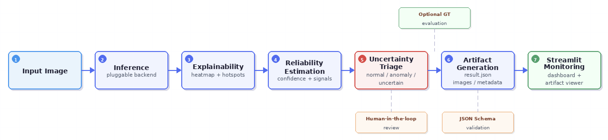

# Anomaly Detection System with Uncertainty Triage and Explainability


[](https://anomaly-detection-system-fdzmlgexhzgfzh6flfpmqw.streamlit.app/)


A production-oriented anomaly detection system that integrates explainability, reliability estimation, and uncertainty-aware decision workflows for human-in-the-loop monitoring.


## Overview

In real-world anomaly detection systems, model scores alone are often insufficient for reliable decisions.

Industrial environments frequently produce false positives due to structural patterns, lighting variation, or borderline scores near the decision threshold. In such cases, forcing a strict binary normal/anomaly decision can lead to unreliable automation.

This project explores a **production-oriented anomaly detection workflow** that combines explainability, reliability estimation, and **uncertainty-aware triage** to support human-in-the-loop monitoring.

The pipeline converts model predictions into structured artifacts that support monitoring, explainability, and uncertainty-aware decision workflows.

Reliability signals and triage decisions are derived from score margin and heatmap structure.

In this design, **model outputs are treated as signals rather than final decisions**, allowing additional reliability checks and triage policies to guide operational workflows.

Pipeline flow:

1. **Inference**  
   Generate anomaly scores and anomaly maps from input images.

2. **Explainability Extraction**  
   Derive heatmap statistics and anomaly hotspots for interpretation.

3. **Reliability Estimation**  
   Estimate prediction confidence using score margin and heatmap signals.

4. **Uncertainty Triage**  
   Borderline predictions are labeled as **uncertain** for human review.

5. **Artifact Generation & Monitoring**  
   Save schema-validated artifacts (`result.json`, visualizations) for inspection in the Streamlit dashboard.


## Example Monitoring Dashboard

Run-level monitoring interface showing anomaly score vs reliability confidence.

<p align="center">
  
</p>


## Example Detection Result

Example anomaly heatmap overlay produced by the pipeline.

<p align="center">
  
</p>


## Pipeline Architecture

The system follows a production-oriented workflow that combines model inference, explainability, reliability estimation, and uncertainty-aware decision logic.

<p align="center">
  
</p>

The pipeline generates schema-validated artifacts (`result.json`) that enable monitoring, explainability, and human-in-the-loop review.


## Quick Start

Run the pipeline on an example dataset and inspect results in the monitoring dashboard.

Activate the virtual environment

```bash
python -m venv .venv
source .venv/bin/activate
```

Install dependencies

```bash
pip install -r requirements.txt
```

Run the pipeline on an MVTec example

```bash
python -m src.cli.run \
  --input datasets/mvtec/bottle/test \
  --out artifacts/runs \
  --run_id mvtec_bottle \
  --validate_schema \
  --threshold_mode normal_p995 \
  --threshold_normal_dir datasets/mvtec/bottle/train/good \
  --gt_dir datasets/mvtec/bottle/ground_truth \
  --framework anomalib \
  --model_name patchcore \
  --ckpt_path assets/models/bottle_patchcore.ckpt
```

Launch the monitoring dashboard

```bash
streamlit run app/streamlit_app.py
```

**Notes**

- `--threshold_normal_dir` should contain normal-only reference images when using `normal_p995`.
- `--gt_dir` is optional and enables GT-based evaluation when ground-truth masks are available.
- `--ckpt_path` must point to a valid trained model checkpoint.
- Generated artifacts are saved under `artifacts/runs/<run_id>/`.


## Key Features

**Contract-driven pipeline**

- Each prediction produces a schema-validated `result.json`.
- This enables stable interfaces for visualization, monitoring, and downstream tools.

**Uncertainty-aware triage**

- Borderline predictions are labeled as **uncertain** instead of forcing binary decisions.
- This supports safe human review in anomaly detection workflows.

**Reliability estimation**

- Confidence signals are derived from score margin and heatmap structure.
- These signals help assess prediction trustworthiness.

**Artifact-based monitoring**

- Each run generates structured artifacts including metadata and visualizations.
- Artifacts serve as the single source of truth for debugging and analysis.

**Human-in-the-loop workflow**

- The system prioritizes safe automation by routing uncertain samples for manual inspection.


## Monitoring & Visualization

The Streamlit dashboard provides run-level monitoring and sample-level inspection of anomaly detection results.

It visualizes prediction scores, reliability signals, and triage outcomes across the entire run, enabling quick identification of borderline or uncertain samples.

Operators can explore anomaly heatmaps, explanations, and structured `result.json` artifacts directly from the dashboard, supporting human-in-the-loop analysis and debugging.

The dashboard is intended for monitoring anomaly detection runs rather than serving as a production UI.


## Limitations & Future Work

This repository focuses on demonstrating a **production-oriented anomaly detection pipeline design**, rather than a fully deployed industrial system.

Several aspects are intentionally simplified.

Planned improvements:

- [ ] Support additional anomaly detection backends beyond PatchCore  
- [ ] Add Docker support for reproducible deployment  
- [ ] Introduce an API layer for real-time inference  
- [ ] Integrate time-series or tabular signals commonly used in industrial processes  
- [ ] Extend the pipeline with MLOps components for model lifecycle and monitoring